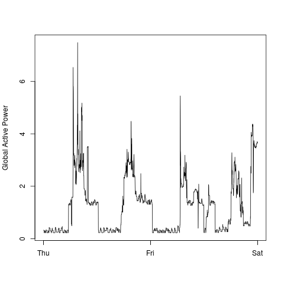
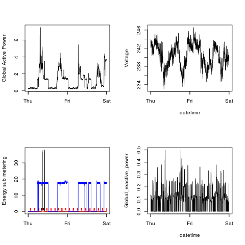

EDA - Exploratory Data Analysis
===

My answers to Coursera Course Projects

## Project 1

### Plot 1

[Plot 1 Code](Project_1/plot1.R)
### Plot 2

[Plot 2 Code](Project_1/plot2.R)
### Plot 3

[Plot 3 Code](Project_1/plot3.R)

## Plot 4

[Plot 4 Code](Project_1/plot4.R)
